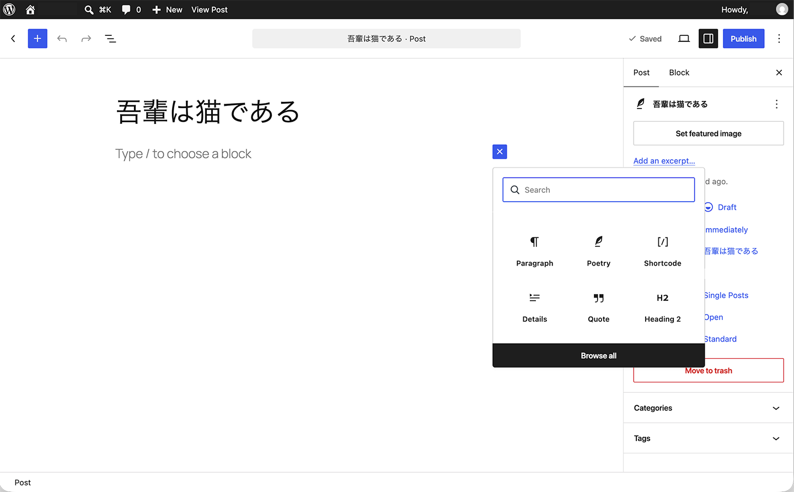
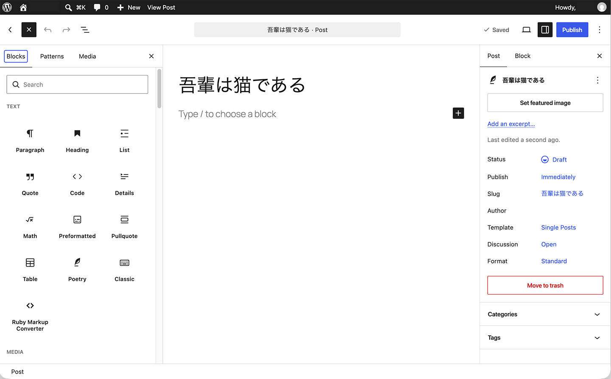
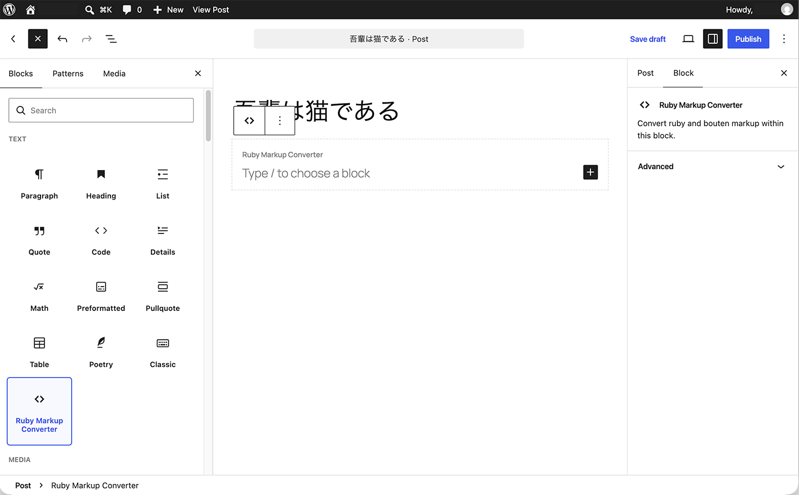
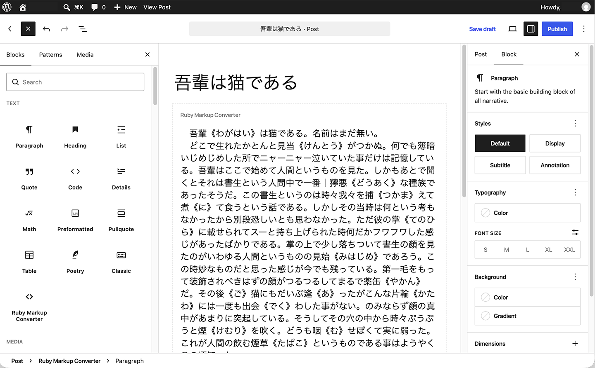
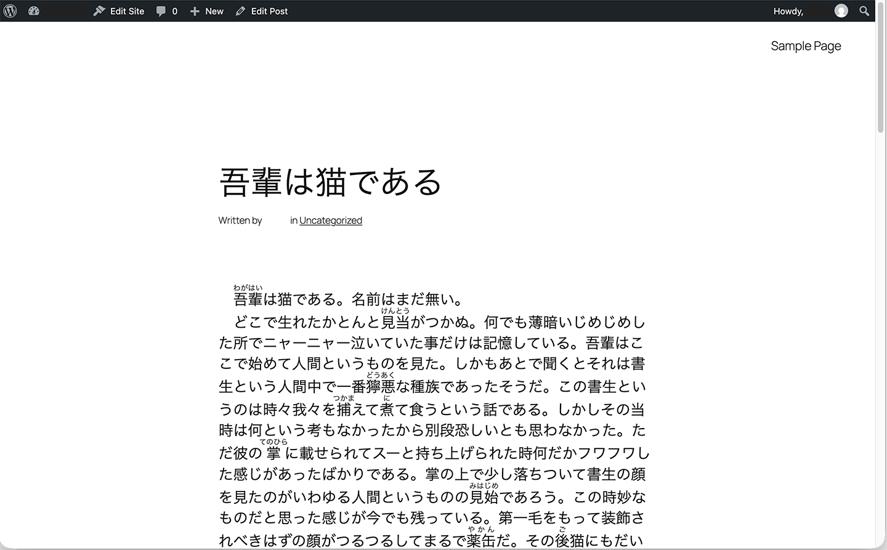

# Ruby Markup Converter User Guide

This guide explains how to use Ruby Markup Converter to display ruby annotations and bouten (emphasis dots) in WordPress while keeping the original markup notation in your manuscript.

## 1. Introduction

Ruby Markup Converter is a WordPress plugin for authors who write manuscripts using ruby and bouten notation commonly supported by online novel submission sites.

Instead of adding ruby annotations again after copying a manuscript into WordPress, you can keep the notation already present in your text. Ruby Markup Converter converts supported notation when the post is displayed to readers.

The original notation remains in the WordPress editor and in the stored post content. The plugin performs the conversion when the content is displayed.

There are two main ways to control where conversion takes place:

* **Selected areas only** — Use a Ruby Markup Converter block around the content you want to convert. You can also use the `[rubymaco]...[/rubymaco]` shortcode.
* **Entire post content** — Apply conversion to the whole post without placing the text inside Ruby Markup Converter blocks.

For most new content created with the WordPress block editor, using the Ruby Markup Converter block is recommended.

---

## 2. Getting Started

After installing and activating Ruby Markup Converter:

1. Open **Settings > Ruby Markup Converter** in the WordPress administration screen.
2. Choose the conversion scope.
3. Enable the ruby markup styles you want to use.
4. Configure bouten settings if needed.
5. Save your settings.

If you are using the plugin for the first time, starting with selected-area conversion is recommended. This lets you explicitly control which parts of a post are processed by the plugin.

You can then create or edit a post in the WordPress block editor and add a **Ruby Markup Converter** block wherever conversion is needed.

---

## 3. Supported Markup

### 3.1 Ruby

Ruby Markup Converter supports the following ruby notation styles:

```text
｜BaseText《RubyAnnotation》
BaseText《RubyAnnotation》
BaseText(RubyAnnotation)
[[rb:BaseText > RubyAnnotation]]
#BaseText__RubyAnnotation__#
{{ruby|BaseText|RubyAnnotation}}
```

For example:

```text
｜東京《とうきょう》
```

is displayed to readers as the base text "東京" with "とうきょう" as its ruby annotation.

Each ruby notation style can be enabled or disabled individually from the Ruby Markup Converter settings screen.

This is useful if your manuscript uses only one particular notation style and you want to avoid interpreting similar character sequences elsewhere in the post as ruby markup.

### 3.2 Bouten

Ruby Markup Converter supports bouten (emphasis dots) using the following notation:

```text id="sqb04c"
《《Emphasis》》
```

For example:

```text id="8r0a7w"
This is 《《important》》.
```

The text enclosed by the bouten notation is displayed with emphasis marks according to the bouten settings selected in the plugin.

The bouten style and rendering method can be configured from the Ruby Markup Converter settings screen.

---

## 4. Using the Ruby Markup Converter Block

The Ruby Markup Converter block lets you define exactly which parts of a post should be processed by the plugin.

It acts as a container for normal WordPress blocks, so you can write or paste your manuscript inside it while continuing to use the block editor as usual.

### 4.1 Adding the Block

1. Open a post or page in the WordPress block editor.
2. Click the **+** button to add a block.



3. Click **Browse all** to open the full block inserter.



4. Find and select **Ruby Markup Converter**.

The Ruby Markup Converter block is added to the editor and is ready for content.



### 4.2 Adding or Pasting a Manuscript

The Ruby Markup Converter block acts as a container for normal WordPress blocks.

Place Paragraph blocks and other content blocks inside it, then type or paste your manuscript as usual.

For example, a Paragraph block inside the Ruby Markup Converter block might contain:

```text
｜東京《とうきょう》には、まだ《《知らない》》場所がたくさんある。
```

You do not need to manually replace the notation with HTML ruby elements or formatted emphasis. Keep the supported ruby and bouten notation intact when typing or pasting your manuscript.

The following example shows a manuscript pasted into a Ruby Markup Converter block:



### 4.3 What You See in the Editor

Ruby and bouten notation remains visible as written while you are editing the post. The conversion does not replace the notation in the editor.

The Ruby Markup Converter block displays an editor-only visual guide and label so that you can easily identify the area where markup conversion applies.

The visual guide and label are editing aids only. They are not part of the content or design of the published post and are not displayed to readers.

### 4.4 What Readers See

When the post is displayed, Ruby Markup Converter processes supported notation within the block.

For example:

```text
｜東京《とうきょう》
```

is rendered as a ruby annotation, while:

```text
《《important》》
```

is rendered using the configured bouten style.

The original notation remains stored in your post. The plugin performs the conversion when the content is displayed.

The editor-only visual guide and label used to identify the Ruby Markup Converter block are not displayed on the published post.

The following example shows the converted content as it appears to readers:



---

## 5. Conversion Scope

Ruby Markup Converter provides two conversion scopes.

### 5.1 Selected Areas Only

In selected-area mode, conversion is limited to content explicitly placed inside a Ruby Markup Converter block or a `[rubymaco]...[/rubymaco]` shortcode.

Content elsewhere in the post is left unchanged.

For example:

```text
Normal paragraph
↓
Not converted

Ruby Markup Converter block
↓
Converted

Normal paragraph
↓
Not converted
```

This mode is recommended when only certain parts of a post contain ruby or bouten notation.

It also reduces the possibility of text elsewhere in the post being unintentionally interpreted as markup.

### 5.2 Entire Post Content

To apply Ruby Markup Converter to the whole post:

1. Open **Settings > Ruby Markup Converter**.
2. Set the conversion scope to **Apply to Entire Post Content**.
3. Save your settings.

In this mode, supported ruby and bouten notation can be written anywhere in the post content without placing it inside a Ruby Markup Converter block.

Text inside Ruby Markup Converter blocks and `[rubymaco]...[/rubymaco]` shortcodes is also handled correctly.

Entire-post conversion is convenient for posts that consist mostly of manuscripts containing ruby or bouten notation. However, text that happens to match an enabled markup pattern elsewhere in the post may also be converted.

For that reason, selected-area conversion is generally the safer starting point.

---

## 6. Using the Shortcode

Ruby Markup Converter also supports the `[rubymaco]...[/rubymaco]` shortcode.

To use the shortcode, enter the opening and closing shortcode tags manually around the content you want to convert:

```text
[rubymaco]
Your manuscript goes here.
[/rubymaco]
```

For example:

```text
[rubymaco]
｜東京《とうきょう》には、まだ《《知らない》》場所がたくさんある。
[/rubymaco]
```

In the WordPress block editor, you can enter the shortcode and its content in a standard **Shortcode** block.

Supported notation between the `[rubymaco]` and `[/rubymaco]` tags is converted when the content is displayed.

The shortcode is retained for compatibility with content created with earlier versions of Ruby Markup Converter. For new content in the WordPress block editor, using the **Ruby Markup Converter** block is recommended. It does not require you to enter shortcode tags manually, and the conversion area is easier to identify while editing.

---

## 7. Settings

Open **Settings > Ruby Markup Converter** to configure the plugin.

The settings screen lets you control the following options.

### 7.1 Conversion Scope

Choose whether Ruby Markup Converter processes only explicitly selected areas or the entire post content.

When selected-area conversion is enabled, use Ruby Markup Converter blocks or `[rubymaco]...[/rubymaco]` shortcodes to specify which content should be processed.

When entire-post conversion is enabled, supported notation throughout the post content is processed automatically.

### 7.2 Ruby Markup Rules

Enable or disable individual ruby notation styles.

If your manuscripts use only one or two notation styles, enabling only the styles you need can help prevent unintended conversions.

### 7.3 Bouten

Enable or disable bouten conversion and choose the bouten style used for emphasis.

### 7.4 Bouten Rendering Method

Choose how bouten is rendered in the published content.

The available rendering methods allow Ruby Markup Converter to generate emphasis appropriate for the selected configuration.

After changing any settings, save the settings before checking the result on a post or page.

---

## 8. Examples

### 8.1 Ruby Example

Input in the editor:

```text
私は｜東京《とうきょう》へ向かった。
```

Published result:

"東京" is displayed with "とうきょう" as its ruby annotation.

### 8.2 Bouten Example

Input in the editor:

```text
それは《《とても重要》》なことだった。
```

Published result:

"とても重要" is displayed with the configured bouten emphasis.

### 8.3 Ruby and Bouten Together

Input in the editor:

```text
｜東京《とうきょう》で起きた《《不思議な出来事》》だった。
```

Published result:

The ruby notation is rendered as a ruby annotation and the bouten notation is rendered as emphasis.

---

## 9. Troubleshooting

### 9.1 The Notation Is Not Converted

Check the following:

1. Make sure Ruby Markup Converter is activated.
2. Open **Settings > Ruby Markup Converter** and confirm that the markup style you are using is enabled.
3. If you are using selected-area conversion, make sure the text is inside a Ruby Markup Converter block or `[rubymaco]...[/rubymaco]` shortcode.
4. Preview or view the published post. The notation remains unchanged in the editor.
5. Check that the notation matches one of the supported formats.

### 9.2 Text Outside the Block Is Not Converted

This is expected when selected-area conversion is enabled.

Place the text inside a Ruby Markup Converter block, use the `[rubymaco]...[/rubymaco]` shortcode, or change the conversion scope to **Apply to Entire Post Content**.

### 9.3 The Ruby Markup Converter Guide or Label Does Not Appear on the Published Post

This is expected.

The visual guide and label shown in the editor are editing aids only. They identify the conversion area while editing and are deliberately omitted from the published page.

### 9.4 Text I Did Not Intend to Convert Is Being Converted

If **Apply to Entire Post Content** is enabled, any text in the post that matches an enabled markup pattern may be processed.

Switch to selected-area conversion and use Ruby Markup Converter blocks around only the manuscript content that should be converted.

You can also disable markup rules that your manuscripts do not use.

---

## 10. Frequently Asked Questions

### Does Ruby Markup Converter Change the Text Stored in My Post?

No. The plugin converts supported notation for display. Your original ruby and bouten notation remains in the stored post content.

### Should I Use the Block or the Shortcode?

For new posts created in the WordPress block editor, the Ruby Markup Converter block is recommended.

It does not require shortcode tags to be entered manually, and its editor-only visual guide makes the conversion area easy to identify.

The shortcode remains supported for compatibility with existing content and for situations where shortcode-based markup is preferred.

### Can I Use More Than One Ruby Markup Converter Block in a Post?

Yes. You can place Ruby Markup Converter blocks wherever conversion is needed and leave other parts of the post outside them.

### Can I Convert the Whole Post Instead?

Yes. Set the conversion scope to **Apply to Entire Post Content** in the plugin settings.

### Why Does the Editor Still Show the Original Notation?

This is intentional. Ruby Markup Converter preserves the notation you entered and performs the conversion when the content is displayed.

Use Preview or view the published post to check the rendered ruby annotations and bouten.

### What Happens If I Deactivate or Uninstall the Plugin?

Your posts and pages are not rewritten or deleted.

Without Ruby Markup Converter performing the conversion, the original ruby and bouten notation remains in the content and is displayed as written.

If you manually used `[rubymaco]...[/rubymaco]` shortcodes, those shortcode tags also remain in the stored content.

---

## Additional Information

For installation information, version history, and plugin requirements, see the main `readme.txt` included with Ruby Markup Converter.

## Sample Text Credit

The sample manuscript shown in the screenshots is an excerpt from the original Japanese text of *Wagahai wa Neko de Aru* (『吾輩は猫である』; *I Am a Cat*) by Natsume Soseki, a work in the public domain. The source text was obtained from [Aozora Bunko](https://www.aozora.gr.jp/).

Source: [『吾輩は猫である』 — Aozora Bunko](https://www.aozora.gr.jp/cards/000148/card789.html)
