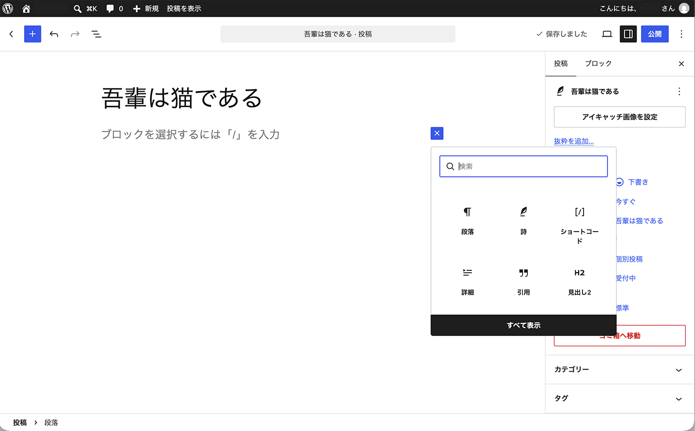
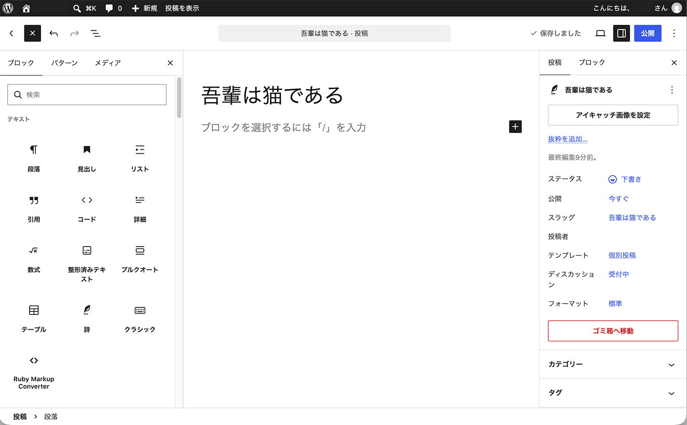
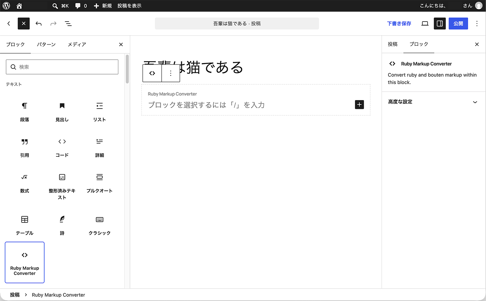
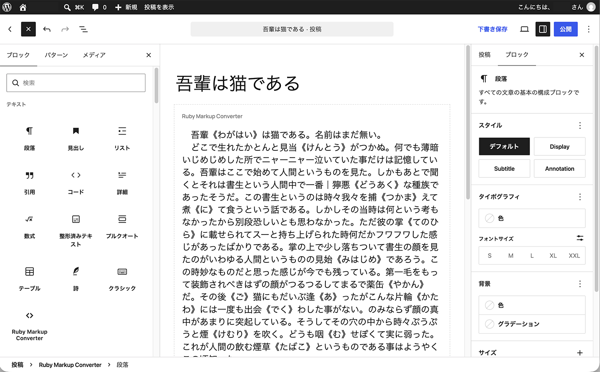
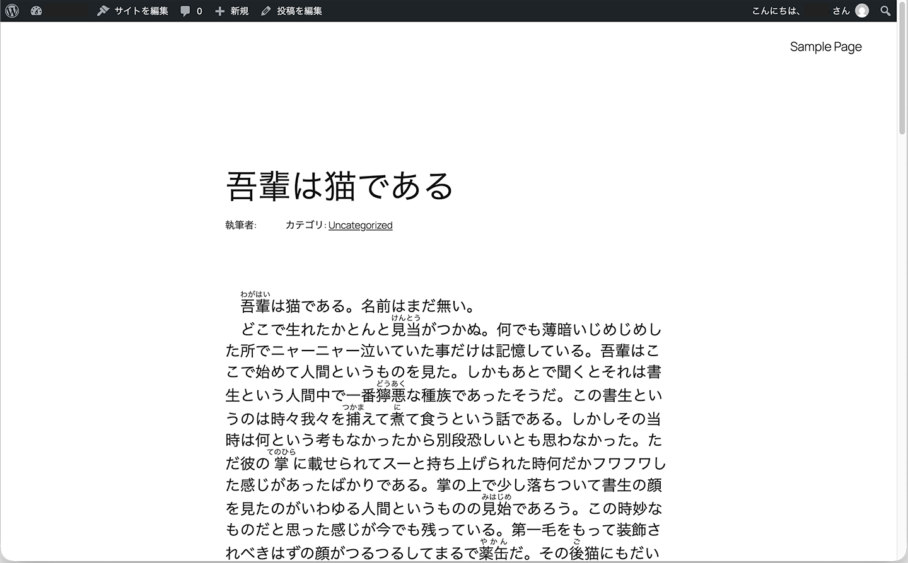

# Ruby Markup Converter ユーザーガイド

Ruby Markup Converter は、小説投稿サイトなどで使われているルビ・傍点記法をそのまま利用して、WordPress上にルビや傍点を表示するためのプラグインです。

このガイドでは、Ruby Markup Converter の基本的な使い方や設定方法について説明します。

## 1. はじめに

Ruby Markup Converter を使うと、小説投稿サイトなどで使用しているルビ・傍点記法を残したまま、原稿をWordPressへコピー＆ペーストして公開できます。

WordPress用にルビを付け直したり、HTMLへ書き換えたりする必要はありません。入力した記法はエディタや投稿データにはそのまま残り、投稿を表示するときにルビや傍点へ変換されます。

変換範囲は、次の2通りから選べます。

* **指定した範囲のみ** — 変換したい原稿を **Ruby Markup Converter** ブロック内に配置します。`[rubymaco]...[/rubymaco]` ショートコードも利用できます。
* **投稿全体** — Ruby Markup Converter ブロックを使わず、投稿全体の対応記法を変換します。

ブロックエディタで新しく投稿を作成する場合は、Ruby Markup Converter ブロックの使用をおすすめします。

---

## 2. はじめに設定すること

Ruby Markup Converter をインストールして有効化したら、次の設定を行います。

1. WordPress管理画面の **「設定」>「Ruby Markup Converter」** を開きます。
2. 変換範囲を選択します。
3. 使用するルビ記法を有効にします。
4. 必要に応じて傍点を設定します。
5. 設定を保存します。

初めて使用する場合は、まず「指定した範囲のみ」を変換する設定をおすすめします。変換する範囲を明確に指定できるため、意図しない箇所が変換されるのを防ぎやすくなります。

設定が終わったら投稿を作成または編集し、変換したい場所に **Ruby Markup Converter** ブロックを追加します。

---

## 3. 対応している記法

### 3.1 ルビ

Ruby Markup Converter は、次のルビ記法に対応しています。

```text
｜BaseText《RubyAnnotation》
BaseText《RubyAnnotation》
BaseText(RubyAnnotation)
[[rb:BaseText > RubyAnnotation]]
#BaseText__RubyAnnotation__#
{{ruby|BaseText|RubyAnnotation}}
```

たとえば、

```text
｜東京《とうきょう》
```

と入力すると、「東京」に「とうきょう」のルビが表示されます。

各ルビ記法は、Ruby Markup Converter の設定画面で個別に有効・無効を切り替えられます。

使用する記法だけを有効にしておくことで、本文中の似た文字列が意図せずルビとして変換されるのを防ぐことができます。

### 3.2 傍点

傍点は、次の記法に対応しています。

```text
《《強調する文字》》
```

たとえば、

```text
これは《《とても重要》》です。
```

と入力すると、「とても重要」の部分に、設定したスタイルの傍点が表示されます。

傍点の種類や表示方法は、Ruby Markup Converter の設定画面から変更できます。

---

## 4. Ruby Markup Converter ブロックを使う

Ruby Markup Converter ブロックを使うと、投稿内のどの範囲を変換するかを指定できます。

通常のWordPressブロックを内包するコンテナとして機能するため、普段と同じようにブロックエディタを使いながら、その中に原稿を入力したり貼り付けたりできます。

### 4.1 ブロックを追加する

1. WordPressのブロックエディタで、投稿または固定ページを開きます。
2. **「+」** ボタンをクリックしてブロック追加メニューを開きます。



3. **「すべて表示」** をクリックして、ブロック一覧を開きます。



4. **「Ruby Markup Converter」** を探して選択します。

エディタ内に空の Ruby Markup Converter ブロックが追加されます。



### 4.2 原稿を入力・貼り付けする

Ruby Markup Converter ブロックの中には、段落など通常のWordPressブロックを配置できます。

ブロック内に直接文章を入力するか、別の場所で作成した原稿をコピー＆ペーストしてください。

たとえば、ブロック内の段落に次のように入力できます。

```text
｜東京《とうきょう》には、まだ《《知らない》》場所がたくさんある。
```

ルビや傍点をHTMLへ書き換える必要はありません。対応している記法を残したまま入力・貼り付けしてください。

次の例では、Ruby Markup Converter ブロック内に小説の原稿を貼り付けています。



### 4.3 エディタ上での表示

編集中は、ルビや傍点の記法が入力したとおりに表示されます。エディタ上で記法そのものがルビや傍点に置き換えられることはありません。

Ruby Markup Converter ブロックには、変換範囲がわかるように、エディタ上だけのガイドとラベルが表示されます。

これらは編集をわかりやすくするためのもので、投稿の内容やデザインの一部ではありません。公開したページには表示されません。

### 4.4 公開時の表示

投稿を表示すると、Ruby Markup Converter ブロック内の対応記法が変換されます。

たとえば、

```text
｜東京《とうきょう》
```

はルビとして表示され、

```text
《《重要》》
```

は設定した傍点スタイルで表示されます。

元の記法は投稿データにそのまま保存されており、投稿を表示するときにプラグインが変換します。

また、エディタ上に表示されていた Ruby Markup Converter ブロックのガイドやラベルは、公開ページには表示されません。

次の例は、変換された原稿をプレビューした状態です。



---

## 5. 変換範囲

Ruby Markup Converter では、変換する範囲を2通りから選べます。

### 5.1 指定した範囲のみ変換する

指定範囲のみを変換する設定では、Ruby Markup Converter ブロックまたは `[rubymaco]...[/rubymaco]` ショートコード内の内容だけが変換されます。

それ以外の部分は変換されません。

```text
通常の段落
↓
変換されない

Ruby Markup Converter ブロック
↓
変換される

通常の段落
↓
変換されない
```

投稿の一部だけにルビ・傍点記法を使用する場合に適しています。

また、投稿内の別の文字列が意図せず記法として解釈される可能性を減らすことができます。

### 5.2 投稿全体を変換する

投稿全体を変換するには、

1. **「設定」>「Ruby Markup Converter」** を開きます。
2. 変換範囲を **「投稿全体に適用」** に設定します。
3. 設定を保存します。

この設定では、Ruby Markup Converter ブロックを使用しなくても、投稿内の対応するルビ・傍点記法が変換されます。

Ruby Markup Converter ブロックや `[rubymaco]...[/rubymaco]` ショートコード内の記法も正しく処理されます。

投稿のほとんどがルビ・傍点記法を含む小説原稿などの場合には便利ですが、投稿内の別の文字列が有効な記法と一致すると、それも変換される可能性があります。

そのため、初めて使用する場合は「指定した範囲のみ」の設定をおすすめします。

---

## 6. ショートコードを使う

Ruby Markup Converter は、`[rubymaco]...[/rubymaco]` ショートコードにも対応しています。

使用する場合は、変換したい内容を開始タグと終了タグで囲みます。

```text
[rubymaco]
ここに原稿を入力します。
[/rubymaco]
```

たとえば、

```text
[rubymaco]
｜東京《とうきょう》には、まだ《《知らない》》場所がたくさんある。
[/rubymaco]
```

のように入力します。

ブロックエディタでは、WordPress標準の **「ショートコード」** ブロックに、ショートコードと原稿を入力できます。

`[rubymaco]` と `[/rubymaco]` の間にある対応記法が、投稿の表示時に変換されます。

ショートコードは、以前のバージョンで作成した投稿との互換性のため、引き続き利用できます。新しくブロックエディタで投稿を作成する場合は、タグを手入力する必要がなく、変換範囲もわかりやすい **Ruby Markup Converter** ブロックの使用をおすすめします。

---

## 7. 設定

WordPress管理画面の **「設定」>「Ruby Markup Converter」** から、プラグインの設定を変更できます。

### 7.1 変換範囲

Ruby Markup Converter ブロックやショートコードで指定した範囲だけを変換するか、投稿全体を変換するかを選択します。

### 7.2 ルビ記法

使用するルビ記法を個別に有効・無効にできます。

原稿で使用する記法だけを有効にしておくことで、意図しない変換を防ぎやすくなります。

### 7.3 傍点

傍点変換の有効・無効と、使用する傍点スタイルを設定します。

### 7.4 傍点の表示方法

公開時に傍点をどのような方法で表示するかを設定します。

設定を変更したら、保存してから投稿や固定ページで表示を確認してください。

---

## 8. 使用例

### 8.1 ルビ

エディタでの入力：

```text
私は｜東京《とうきょう》へ向かった。
```

公開時には、「東京」に「とうきょう」のルビが表示されます。

### 8.2 傍点

エディタでの入力：

```text
それは《《とても重要》》なことだった。
```

公開時には、「とても重要」に設定したスタイルの傍点が表示されます。

### 8.3 ルビと傍点を一緒に使う

エディタでの入力：

```text
｜東京《とうきょう》で起きた《《不思議な出来事》》だった。
```

公開時には、「東京」にルビが付き、「不思議な出来事」に傍点が表示されます。

---

## 9. トラブルシューティング

### 9.1 記法が変換されない

次の点を確認してください。

1. Ruby Markup Converter が有効になっているか確認します。
2. **「設定」>「Ruby Markup Converter」** で、使用している記法が有効になっているか確認します。
3. 指定範囲のみを変換する設定の場合は、文章が Ruby Markup Converter ブロックまたは `[rubymaco]...[/rubymaco]` ショートコード内にあることを確認します。
4. プレビューまたは公開ページで確認します。エディタ上では元の記法のまま表示されます。
5. 入力した記法が対応形式と一致しているか確認します。

### 9.2 ブロックの外側が変換されない

「指定した範囲のみ」を変換する設定では、これは正常な動作です。

変換したい文章を Ruby Markup Converter ブロック内に配置するか、`[rubymaco]...[/rubymaco]` ショートコードを使用してください。投稿全体を変換する設定に変更することもできます。

### 9.3 公開ページにRuby Markup Converterのガイドやラベルが表示されない

正常な動作です。

エディタ上のガイドやラベルは、編集中に変換範囲をわかりやすくするためのものです。公開ページには表示されません。

### 9.4 意図しない部分まで変換される

投稿全体を変換する設定では、投稿内の文字列が有効な記法と一致すると、意図していない部分も変換されることがあります。

「指定した範囲のみ」に変更し、変換したい原稿だけを Ruby Markup Converter ブロック内に配置してください。

使用しないルビ記法を設定画面で無効にすることも有効です。

---

## 10. よくある質問

### 投稿に保存されている文章そのものが書き換えられますか？

いいえ。Ruby Markup Converter は表示時に記法を変換します。入力したルビ・傍点記法は、投稿データにそのまま残ります。

### ブロックとショートコードのどちらを使えばよいですか？

新しくブロックエディタで投稿を作成する場合は、Ruby Markup Converter ブロックをおすすめします。

ショートコードのタグを手入力する必要がなく、エディタ上で変換範囲も確認できます。

ショートコードも引き続き利用できるため、以前作成した投稿を書き換える必要はありません。

### 1つの投稿で複数のRuby Markup Converterブロックを使えますか？

はい。変換したい場所ごとに Ruby Markup Converter ブロックを配置できます。

### 投稿全体を変換できますか？

はい。設定画面で変換範囲を「投稿全体に適用」に変更してください。

### エディタ上でルビや傍点に変換されないのはなぜですか？

正常な動作です。

入力した記法はエディタ上ではそのまま表示され、投稿を表示するときに変換されます。変換結果はプレビューまたは公開ページで確認してください。

### プラグインを無効化・アンインストールするとどうなりますか？

投稿や固定ページの内容が書き換えられたり、削除されたりすることはありません。

プラグインによる変換が行われなくなるため、保存されているルビ・傍点記法がそのまま表示されます。

`[rubymaco]...[/rubymaco]` ショートコードを使用している場合は、そのショートコードタグも投稿データに残ります。

---

## その他の情報

インストール方法、バージョン履歴、動作要件については、Ruby Markup Converter に含まれる `readme.txt` を参照してください。

## サンプル文章について

スクリーンショット内のサンプル原稿には、著作権の保護期間が満了した夏目漱石『吾輩は猫である』の一部を使用しています。本文は[青空文庫](https://www.aozora.gr.jp/)より取得しました。

出典：[夏目漱石『吾輩は猫である』— 青空文庫](https://www.aozora.gr.jp/cards/000148/card789.html)
